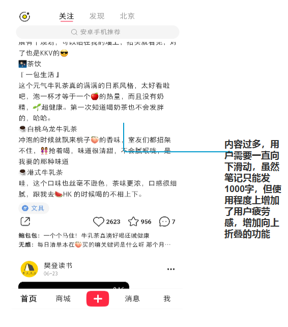

# 小红书产品体验报告
## 一，产品概述
### 1.1 产品介绍
小红书是一个以分享优质产品，分享生活方式为内容的UGC社区。这里汇集着各行各业的用户，用户彼此分享自己的知识，经验，见解。为社区源源不断的提供高质量的内容。逐渐成为人们生活的百科全书和消费类的口碑库。
### 1.2 产品定位
新时代的内容电商平台。以内容为入口，将流量引流到电商的一种新模式。
### 1.3 产品历程
小红书从早期攻略性质的境外购物转型到社区性质的购物笔记，随着社区成熟，用户量的不断庞大，逐渐形成高质量的内容分享社区。企业号推广和福利社上线， 小红书已经从社区升级为社区型的电商，致力于帮助年轻人找到优质的产品并分享他们对优质产品的看法与见解。
## 二，用户分析
### 2.1 用户群体
小红书的用户年龄主要在20到35岁之间，以大学生，白领居多。当中女性用户占70%到80%，主要分布在一线城市。另外女性被公认为潮流的引领者，喜爱“逛”和购物的天性配合对应收入的经济条件使其具有很强的消费力。

  

  

### 2.2 用户特征
小红书上聚集的是向往中产阶级生活的年轻人，她们追求高品质生活，乐于体验新鲜事物和分享,身上有知识分子的理想主义特征，他们认为自己与刷贴吧，刷微博的网友有本质区别，有品位、有态度、有深度的观点才符合其身份认同。

### 2.3 使用场景
用户像逛街一样利用碎片化的时间在分享社区闲逛或者分享自己对优质产品心得，同时激发用户对优质产品的吸引力，从而引起消费。实现社区电商的转换率。
## 三，需求分析
### 3.1 内容消费
无目的性：娱乐消遣,用户分享的奇人轶事和抖机灵内容具有很强的娱乐作用。

有目的性：通过搜索与关键词相关的深度内容，获取"入门指南"或获取达人的推荐，从过来人哪里获取经验和建议，延伸出 一系列诸如导购，测评的需求。
 ### 3.2 内容生产
 心理诉求：释放表达欲望，希望自己的想法被他人了解并认可; 获取成就感,成为意见领袖,被大众认同,追捧;实现自我价值，希望自己的观点能都改变他人，帮助他人。
 收益回报: 建立个人品牌，获取关注，吸引粉丝; 以分享的方式进一步学习，最有效的学习方式就是教别人。版本保障，确保内容原创，不被抄袭。
 ### 3.3 商场
 基本需求：发现优质商品，获取商品的实物图片，价格，产地， 用户评价。
 期望需求：获取商品的购买渠道，得到商品的购买保证和售后服务。
 兴奋需求：以更便宜价格，获得公认的优质商品。
## 四，产品分析
### 4.1 产品结构

小红书的核心模块是首页和商场。首页即社区，主要由关注，发现，本地服务三部分组成。从不同的维度向用户展示内容，用户可以对感兴趣的内容，进行关注，收藏，点赞，评论。商场则跟其他电商平台类似，有商品类目，活动页，购物车。但与其他平台不同的是，小红书没有立即购买，而是领劵购物，通过补贴形式，一定程度上增加用户的粘性。
### 4.2 产品功能分析
#### 4.2.1 首页
##### 功能描述及体验分析
小红书的首页即是社区功能。主要分为关注，发现，本地服务三大类，也就是从"用户","社区","城市"，三个维度来细化社区内容。关注页面显示是用户感兴趣的，喜爱的。发现页面是平台根据用户喜爱好向用户推送的内容，这部分内容是用户浏览笔记的重要途径，内容质量往往决定了用户的停留时间，同时精准的推送也将用户引流到商场，提高转化率。本地服务则是推荐当地的 美食攻略，旅游分享等内容 ,帮助用户发现周边吃喝玩乐的好去处。通过线上线下的连通，增强用户粘性。
##### 建议优化
首页关注页面中，将关注用户和推荐用户合并一个导航条，点击加好查看更多。将已看过的文字内容收缩，节省屏幕所占的屏幕空间，给用户一个已阅读的反馈。发现模块二级导航条，根据用户点击频率，将喜爱的分类放置前列，其次小红书热门话题仅在搜索框下方展示，建议在发现页曝光热门话题，增加用户参与度。

  

  

#### 4.2.2 商场
商场是社区成熟后逐渐发展起来的功能，是产品盈利的渠道。商品主要以品牌店和自营的福利社为主，导致商品和商品类目不全。另外小红书在商品先去页上显示了最新订单的用户和地区信息流，刺激用户购买的欲望。在自营店增加了"小红薯说"评论体系，其他品牌店，则缺少评价系统和销量的展示。
##### 建议优化
目前商场首页推送的的内容多是美妆，穿搭，希望商品多元化，消除用户对小红书的刻板印象; 商品描述比较简单，关于商品评价只有小红薯们怎么说这一部分，在这部分中，都是关于某个商品的相关笔记，其实不是真正意义上的商品评价，因为这些用户并不一定是在小红书购买的这个商品，发布的笔记仅仅是使用体验商品的价值，希望增加评论系统和该商品的销量情况, 同时详情页，增加排行榜，让用户对所购商品有个清晰的认识。

  

## 五，竞品分析
小红书的主要竞品有网易考拉，蘑菇街，知乎，抖音等，这里选择社交交友领域知乎进行竞品分析。虽然同为社区，但两个产品的侧重点有所不同。

产品基本信息对比

基本信息 | 小红书 | 知乎
---|---|---
上线时间 | 2013年 | 2010（邀约）2013（开放）
产品slogan | 标记我的生活 | 有问题，上知乎
定位 | 生活分享社区 | 问答社区
模式 | 内容电商 | 内容付费
特点 | UGC社区，通过笔记实现引流 | 付费授权和专栏赞赏
男女比重 | 女性 | 男性
地域 | 一二线 | 一二线

功能对比

基本信息 | 小红书 | 知乎
---|---|---
私信 | √ | √
问答 | × | √
搜索 | √ | √
直播 | √ | √
商场 | √ | ×
本地 | √ | ×
会员 | √ | √

需求图谱

  

总结: 综上对比，小红书和知乎都是以年轻人为主的UDC社区，只是战略和定位略有不同，但还有一定的交集。对于内容而言，一个则平民化，而另一个则专业化。从而看出小红书的优势与劣势。优势以生活为主，类目众多，大多数用户都能触及到。劣势就是缺乏专业性。 小红书在生活内容方面应该广而博,注重内容质量，增加对内容监控和高质内容的引导。这样也就是拓宽了另一种盈利渠道（知识付费）。 小红书还应关注男性需求，将"女性","美妆"，这样的标签慢慢淡化。增加数据，科技，户外这样话题。

## 六，总结
小红书从2013年上线以来，通过不断的产品迭代，积累了庞大的用户规模和用户口碑，逐渐成为综合社区的佼佼者。如今的小红书以高质量的UGC内容为基础，将流量引流到商场，形成了“社交+电商”的商业闭环。然而，无论是 内容社区还是电商平台，都有亟待解决的问题。内容存在大量的广告和虚假内容，小红书也一直在进行社区反作弊和违规账户治理，运用机器学习来限制软性营销、导流类内容发布，同时还在社区推行“社区生态观”，让更多用户参与到内容判断中，为社区营造了良好的氛围。另一方面，小红书电商市场份额的占有率仍然较低，自营电商也被曝光出产品质量差，售后服务不到位等问题，目前小红书正在借助自身大数据、人工智能等新技术，构建数字时代的新型知识产权保护体系，并构建了“ 涉假评价、高危客诉、舆情监控”全流程的THEMIS系统，多维度分析可疑售假店铺行为；在仓储物流上，宁波保税新政实施，实现了同仓存储、同包发货措施，让消费者有更好的购物体验。相信不久小红书也会迎来新的高度。
